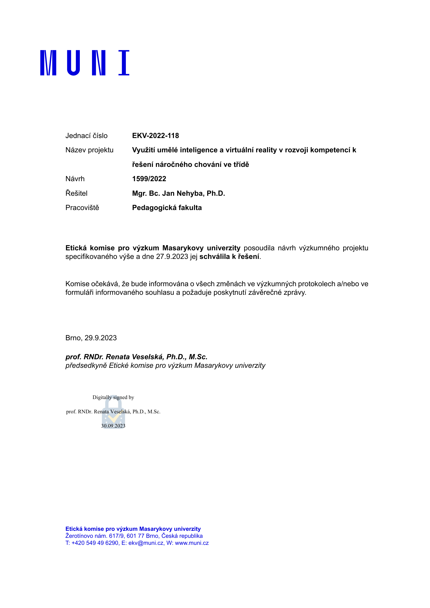

# Příloha D. Etické náležitosti


Tato příloha dokládá etické náležitosti sběru a zpracování dat: postavení
přispěvatelů kazuistik, znění informovaného prohlášení, anonymizační protokol,
schválení etickou komisí a pravidla nakládání s nezveřejněnými kazuistikami.
Sběr probíhá v rámci projektu TA ČR TQ01000030
<!-- necislo: identifikátor projektu --> bez sběru přímých osobních údajů.
Databáze kazuistik je anonymizovaným výstupem tohoto projektu.

Zastřešující projekt (schválený etickou
komisí, oddíl D.2) má dvě datové větve; tato kniha čerpá výhradně z větve
kazuistik. Podle posouzení Etické komise pro výzkum MU autoři kazuistik
(studující učitelství a učitelé) nejsou účastníky výzkumu ve vlastním smyslu,
neboť nejsou předmětem zkoumání: neposkytují data o sobě, nýbrž odevzdávají
anonymizovaný text případu, z něhož se dále zpracovávají dílčí datové výřezy.
Nástrojem proto není klasický souhlas subjektu výzkumu, ale informované
prohlášení přispěvatele (níže).

## D.1 Informované prohlášení přispěvatele

Prohlášení se uděluje jako odpovědník přímo v Informačním systému MU
(ne jako samostatný podepsaný dokument). Přispěvatel se seznámí s informací
o výzkumu a poté vyplní sedm položek: vlastní identifikaci (jméno; UČO
a kontakt jen tam, kde je to nutné) sloužící k evidenci prohlášení, a tři
výslovné souhlasy (využití anonymizované kazuistiky, potvrzení o informování
učitele-zdroje, závazek úplné anonymity). Doslovné znění (kráceno jen ve výčtu
přínosů, vyznačeno […]):

```text
1. Informace o výzkumném projektu
Název projektu: Využití umělé inteligence a virtuální reality v rozvoji
kompetencí k řešení výchovných situací ve škole
Hlavní výzkumník: Jan Nehyba, Katedra pedagogiky, Pedagogická fakulta MU

O čem je tento výzkumný projekt?
Významným problémem studentů učitelství a učitelů je udržení kázně ve
školách. Cílem projektu je vytvořit rozsáhlou webovou platformu inteligentní
databáze případů (kazuistik) nazvanou Edupříběhy, které dokládají osvědčené
postupy úspěšného i neúspěšného řešení problémového chování žáků. Tato
platforma umožní studentům učitelství, učitelům a dalším uživatelům
vyhledávat podobné případy […] a trénovat si specifické respektující
dovednosti. […]

Jak bude účast probíhat?
Vypracujete anonymizovanou kazuistiku, která bude zařazena do souboru
výzkumných dat. […] Získaná data v anonymní podobě mohou být použita
v dalších výzkumných projektech v této oblasti. Souhlasem vyjadřuji
porozumění tomu, co znamená vytvořit anonymizovanou kazuistiku […].

Je účast v tomto výzkumu povinná?
Účast ve výzkumu je dobrovolná, pokud se rozhodnete neudělit souhlas
s výzkumem, nebude Vaše odevzdaná kazuistika do souboru výzkumných dat
zařazena. Udělení či neudělení souhlasu nijak neovlivňuje Váš průchod
předmětem.

Kde se dozvědět více o projektu?
O projektu Edustories se můžete dozvědět zde: https://edustories.cz/
Kdykoliv je možné tento souhlas odvolat, a to formou odeslání e-mailu
s prosbou o odvolání na adresu nehyba@ped.muni.cz.
Podepsaný souhlas si můžete vytisknout z informačního systému.
[Potvrzení:] Potvrzuji, že jsem si přečetl/a informace o výzkumném projektu.

2.–4. [Identifikace pro evidenci souhlasu:] celé jméno a příjmení; UČO;
kontaktní e-mail.

5. Na základě výše uvedených informací souhlasím s poskytnutím anonymizované
kazuistiky pro výzkumné a aplikační účely veřejné databáze kazuistik.
   [Ano, souhlasím / Ne, nesouhlasím]

6. Potvrzuji, že informuji osobu, od které kazuistiku získám, že kazuistika
bude použita ve výše uvedeném projektu a navazujících projektech.

7. Zavazuji se, že odevzdaná kazuistika bude zcela anonymní a nebude možné
z ní identifikovat jakékoliv osoby.
```

*Poznámka.* Přepsáno z informovaného prohlášení, které je vedeno jako odpovědník v Informačním systému MU (autoritativní živé znění, poskytnuté autorem 17. 7. 2026). Nahrazuje dřívější revizní pracovní dokument.

Ze znění prohlášení plynou tři důsledky, s nimiž kniha pracuje. Za prvé, účast
je dobrovolná, prohlášení lze odvolat e-mailem a jeho (ne)udělení nemá
vliv na průchod předmětem. Citované znění nestanovuje, že odvolání působí
pouze do budoucna. U textu bez vazby na pisatele může být praktickým
omezením jeho zpětné dohledání; to však není důvod měnit význam souhlasu
ani obecně vylučovat vyřízení žádosti o stažení konkrétního případu. Za druhé,
kazuistika je anonymizovaná už při vzniku: přispěvatelé se položkami 6 a 7
zavazují, že odevzdaný text bude zcela anonymní; identifikace v položkách 2–4
slouží jen k evidenci prohlášení, ne jako výzkumná data (proto se datová sada
kazuistik vede „bez sběru osobních údajů“ a kniha mluví o sběru „bez přímých
osobních údajů“; případné reziduální nepřímé údaje odstraňuje anonymizační
protokol, oddíl D.2). Za třetí, prohlášení výslovně počítá s užitím anonymních
dat v navazujících projektech,
o něž se opírá i tato kniha.

## D.2 Anonymizační protokol

Anonymizace je trojstupňová s následnou ruční kontrolou. Interní
metodologický rukopis projektu ji popisuje takto (slovensky, doslovně):

```text
Prvý stupeň zabezpečovali participanti, poučení o anonymizácii, tak, že
nevkladali žiadne pravé, identifikačné údaje o školách, či osobách
v kazuistikách. Druhý stupeň anonymizácie prebiehal vo výskumnom tíme
prostredníctvom Czech Named Entity Corpus 2.0.. Tretí stupeň vykonával
jazykový model (LLM). Následne boli kazuistiky manuálne skontrolované,
či sa v nich nevyskytujú žiadne identifikačné údaje. Celý proces bol
vopred schválený etickou komísiou MUNI.
```

*Poznámka.* Přepsáno z interního metodologického dokumentu projektu, oddíl Etické aspekty (doslovně včetně interpunkce předlohy).

Technicky je druhý stupeň realizován rozpoznáváním pojmenovaných entit
(NameTag, Czech Named Entity Corpus 2.0) s náhradou osobních a místních
jmen zástupným řetězcem a třetí stupeň instrukcemi jazykového modelu ve
strukturačním promptu; obojí doslovně dokládá příloha B. Tento postup
platí pro všechna data analyzovaná v knize (řezy po květen 2026). Od
července 2026 provádí anonymizaci na platformě otevřený velký jazykový
model provozovaný v akademickém prostředí národní e-infrastruktury
(e-INFRA CZ), a to zásadně před jakýmkoli případným voláním komerční
služby a bez záložního přesměrování jinam; osobní údaje tak neopouštějí
akademickou infrastrukturu.

Nejnovější verze databáze prošla dalším anonymizačním zpracováním.
Rozpoznávání pojmenovaných entit nástrojem NameTag od ÚFAL s modelem
CNEC proběhlo lokálně. Následnou anonymizaci prováděly jazykové modely
v prostředí e-INFRA CZ na serverech Masarykovy univerzity. Jde o další
zpracování databáze, které je třeba odlišit od archivovaného postupu
v příloze B i od dřívějšího výběrového ověření popsaného níže.

### Schválení etickou komisí

Výzkumný projekt, v jehož rámci korpus vznikl
(„Využití umělé inteligence a virtuální reality v rozvoji kompetencí k řešení
náročného chování ve třídě“, návrh č. 1599/2022), posoudila a schválila Etická
komise pro výzkum Masarykovy univerzity pod jednacím číslem EKV-2022-118:
předběžné schválení 12. 12. 2022, finální schválení k řešení 27. 9. 2023
(předsedkyně prof. RNDr. Renata Veselská, Ph.D., M.Sc.).
<!-- necislo: jednací čísla EKV a návrhu + data stanoviska, nejde o analytická čísla -->
Název projektu se mezi dokumenty liší: etický protokol EKV nese znění
„…k řešení náročného chování ve třídě“, zatímco projektová dokumentace TA ČR
i formulář informovaného prohlášení (oddíl D.1) používají znění
„…k řešení výchovných situací ve škole“; jde o týž projekt (TQ01000030)
a kniha obě znění uvádí podle zdroje, z něhož cituje.
Komise si vyžádala informování o změnách protokolu i formuláře informovaného
souhlasu a závěrečnou zprávu. Kopie stanoviska je součástí dokumentace řízení;
reprodukci finálního schválení uvádí Obrázek D.1.



### Výběrové ověření anonymizace

Toto ověření se vztahuje k dřívější verzi zveřejněných kazuistik,
nikoli k nejnovějšímu anonymizačnímu průchodu.

Dodržení protokolu jsme ověřili na náhodném vzorku 50
<!-- manifest priloha_d_audit_cisla: audit_n_vzorek=50 --> zveřejněných
kazuistik třemi vrstvami kontroly: heuristikami na zbytky linky,
nezávislým druhým průchodem týmž nástrojem rozpoznávání entit a ručním
posouzením všech nálezů. Výsledek: žádné technické zbytky automatického
zpracování, žádné
plné jméno, příjmení, název školy ani obec vázaná na osobu. V 7
<!-- manifest priloha_d_audit_cisla: audit_n_kazuistik_s_identifikatorem=7 -->
kazuistikách vzorku však zůstala holá křestní jména či jejich domácké podoby
(celkem 35
<!-- manifest priloha_d_audit_cisla: audit_n_identifikatoru=35 --> výskytů
tvarů) bez explicitního označení, že jde o jméno smyšlené; v dalších
kazuistikách text užití pseudonymu výslovně přiznává („nazvěme ho…“).
Samotné poučení pisatelů a nepřítomnost příjmení nebo místa nedokládají
anonymitu všech kombinací nepřímých údajů. Výběrová kontrola proto
neumožňuje kvantifikovat celkové riziko identifikace. Nálezy byly určeny
k redakčnímu dořešení; tento historický výsledek nedokládá stav jednotlivých
případů po nejnovějším anonymizačním průchodu. Ten podle upřesnění autora
zahrnoval lokální CNEC/ÚFAL a modely e-INFRA CZ na serverech MU, jak je
popsáno výše. V textu knihy nevystupují žádné přímé
identifikátory; anotátorky vystupují výhradně pod pseudonymy A1–A12
(kapitola 4). Doprovodný balíček knihy zpřístupňuje odvozené tabulky,
nikoli úplné texty kazuistik. Pravidla nakládání s textovými podklady
popisuje metodologie (kapitola 4).

---
